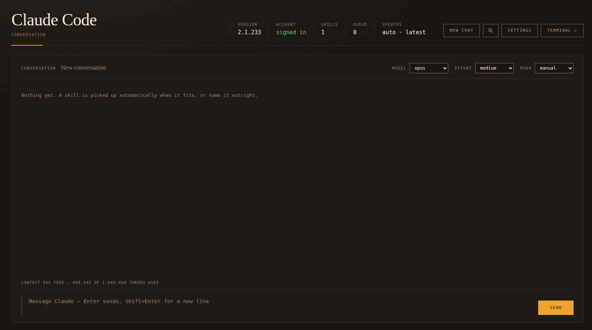

# Home Assistant add-on: Claude Code

A Home Assistant add-on repository containing one add-on.



## Requirements

Claude Code is a native binary that **requires the AVX instruction set**, so check
the machine hosting Home Assistant before installing:

```bash
grep -m1 -ow avx /proc/cpuinfo || echo "no AVX: Claude Code cannot run here"
```

No output means the add-on will install and start, but the binary will die with
`Illegal instruction` and there is no workaround. Low-power chips such as AMD
Bobcat (E-350, E-450) and the Intel Atom and Celeron parts of that era lack AVX
regardless of the machine's age. On a virtual machine it may just be hidden by a
generic guest CPU type — see
[claude-code/DOCS.md](claude-code/DOCS.md#hardware-requirements).

Also required: x86-64 or ARM64, 4 GB+ RAM, and a Claude account on a Pro, Max,
Team, or Enterprise plan.

## Installation

**Settings → Add-ons → Add-on Store → ⋮ → Repositories**, then add:

```
https://github.com/paradoxm/ha-addon-claude-code
```

## Signing in

The add-on ships no credentials and asks for none in its configuration: it signs
in the way the CLI does, once, from its own terminal.

1. Start the add-on and open **Web UI**. Until it is signed in the console says so
   in a banner, and the account reads *not signed in*.
2. Click **Terminal** and run:

   ```bash
   claude
   ```

3. Choose your Claude account when it asks, and it prints a link with a code. Open
   the link in a browser — on any machine, it does not have to be this one — approve
   it, and paste the code back into the terminal.
4. Check it took:

   ```bash
   claude auth status
   ```

   It answers with the account's email, organisation and plan. The console's header
   turns to *signed in* on its next poll, and `GET /health` reports `logged_in`.

The sign-in is kept in the add-on's own `/data` volume, so it survives restarts,
add-on updates and CLI updates, and it goes into Home Assistant's backups with
everything else. Once is enough: the access token lives about eight hours and the
add-on renews it from the refresh token beside it, before it can expire, whether or
not anybody is watching.

To sign out, or to move the add-on to another account, run `claude auth logout` in
the same terminal and start again from step 2.

A Claude account on a **Pro, Max, Team or Enterprise** plan is required — Claude
Code does not run on the free plan.

## Add-ons

### [Claude Code](claude-code/)

Runs the Claude Code CLI in Home Assistant: a console for talking to Claude with
your own skills installed, a terminal for signing in, and an HTTP API so another
add-on can send prompts with input files and collect the results.

See [claude-code/DOCS.md](claude-code/DOCS.md).

## The HTTP API

The console is only one way in. The same add-on answers HTTP, so anything else in
the house — a Home Assistant automation, another add-on, a script on the LAN —
can hand Claude a piece of work and collect the result. That is the point of it:
Claude Code is a terminal program, and this makes it something a machine can drive.

Set **API token** in the add-on's configuration and map port `7682`. Without a
token the API listens on localhost only, and the port stays shut.

```bash
# Is it alive, signed in, and busy?
curl -H "Authorization: Bearer $TOKEN" http://homeassistant.local:7682/health

# A message in the console's own conversation, answered in the background
curl -H "Authorization: Bearer $TOKEN" -H "Content-Type: application/json" \
     -d '{"prompt": "summarise today's energy use", "chat": true}' \
     http://homeassistant.local:7682/jobs

# How that turn is getting on: status, the words so far, the tools it is using
curl -H "Authorization: Bearer $TOKEN" http://homeassistant.local:7682/jobs/<id>

# And what it produced
curl -H "Authorization: Bearer $TOKEN" http://homeassistant.local:7682/jobs/<id>/files
```

A job can carry input files, run against a chosen model and effort, be cancelled,
frozen and let go again, and its files downloaded singly or as an archive. There is
also `/state/<key>`: a small place for the caller's own notes, because something
driving hours-long runs has state of its own and the platform it runs on may not
keep it honestly.

The whole reference — every route, every field, and the shape of a job — is in
[claude-code/DOCS.md](claude-code/DOCS.md#http-api).

## The plan's allowance

A long turn can run into the plan's limit halfway through, and until the window
resets there is nothing to do but wait. The add-on watches that itself, because it
owns the process and nothing else can stop the CLI the moment a wall appears:

- a turn is **refused** with `429` when a window is already past its figure, and the
  answer says which window, how full it is and when it comes back;
- a turn that runs into the wall is **frozen where it stands** — `SIGSTOP` to the
  whole process group, so every subagent stops with it. Nothing more is spent and
  nothing is lost;
- once the window resets it **carries on by itself**, from exactly where it stopped.

Two figures, set separately, because the two windows are not the same question:

| Option | What it governs |
| --- | --- |
| **Stop the five-hour window at** (`session_threshold`) | The window that refills as the day goes on. Spending it to the brim costs an hour of waiting, so most people leave this high. |
| **Stop the weekly window at** (`week_threshold`) | What a whole week of work has to fit inside. A lower figure here keeps something in reserve for the days that are left. |
| **Act on the limit** (`guard_limits`) | Off means the add-on only reports the figures and whoever drives it decides. |
| **Read the allowance every** (`usage_check_seconds`) | The one number that governs how often anything of Anthropic's is touched. |

Work stops when *either* window is past its own figure. `GET /usage` reports both
windows, what is used, when each resets, and `enough` — the single answer to "may
work start?", so a caller does not carry its own copy of the rule. The **Usage** tab
in Settings shows the same numbers, with each figure marked on its own bar.

A reading that cannot be had never stops work: the endpoint is undocumented and its
silence must not become a way to lose runs.

## What you may use it for

The add-on signs in as you, in its terminal, and runs the CLI on your own machine.
Running Claude Code that way is [documented by
Anthropic](https://code.claude.com/docs/en/headless): `claude -p` in scripts and CI
is a supported way to use it, and this add-on is a wrapper around exactly that. So
automation is not the question. Who the answers are for is.

| Who the answers are for | Where it stands |
| --- | --- |
| The account holder: automations, jobs sent by another add-on, a private assistant | The documented case. Automating your own account is what headless mode is for. |
| Another person, put in front of it through the same account | Grey. Anthropic's [Consumer Terms](https://www.anthropic.com/legal/consumer-terms) §2 say not to "make your Account available to anyone else", and money is not what that sentence turns on. |
| A service open to others, paid or free | Not this. The [Commercial Terms](https://www.anthropic.com/legal/commercial-terms) §D.4 forbid reselling the Services, and a consumer plan is not for business use at all (§11). |

The sanctioned way to serve other people is the [Claude API](https://platform.claude.com)
with its own key and its own billing — the Commercial Terms allow that explicitly:
outputs may "power products and services Customer makes available to its own
customers and end users". A subscription seat is for the person it belongs to, and a
plan bought by an organisation carries that organisation's rules on top.

Two more things, whether or not money is involved:

- **Say it is AI.** Anthropic's [Usage Policy](https://www.anthropic.com/legal/aup)
  requires a consumer-facing chatbot to disclose that the user is talking to AI
  "at a minimum at the beginning of each chat session". If you put a bot in front of
  this add-on, that line is yours to write.
- **The credentials stay put.** They live in the add-on's own volume and are never
  served over the API. Set an **API token**, keep the port on the LAN, and treat that
  token as what it is: whoever holds it can spend your allowance.

None of this is legal advice — it is what the documents say, with the links to read
them yourself.
